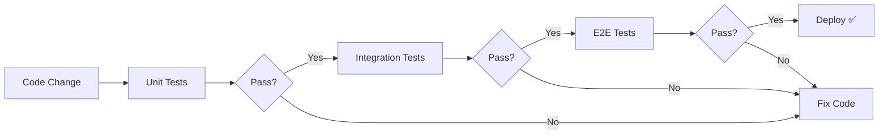

<div align="center">

# 🧪 Unit Testing Mastery

### *A Comprehensive Guide to Testing in JavaScript/TypeScript*


[](https://github.com/WaqarHassan20/unit-testing)
[](https://opensource.org/licenses/MIT)
[](http://makeapullrequest.com)

[📚 Documentation](#-table-of-contents) • [🚀 Quick Start](#-quick-start) • [💡 Examples](#-project-structure) • [🤝 Contributing](#-contributing)

</div>

---

## 📋 Table of Contents

- [🎯 Overview](#-overview)
- [✨ Features](#-features)
- [🏗️ Project Structure](#-project-structure)
- [🚀 Quick Start](#-quick-start)
- [📖 Understanding Testing Types](#-understanding-testing-types)
  - [🔬 Unit Testing](#-unit-testing)
  - [🔗 Integration Testing](#-integration-testing)
  - [🌐 End-to-End Testing](#-end-to-end-testing)
- [📊 Testing Pyramid](#-testing-pyramid)
- [🛠️ Tools & Frameworks](#️-tools--frameworks)
- [📦 Installation Commands](#-installation-commands)
- [🎯 Key Differences](#-key-differences-summary)
- [💻 Usage Examples](#-usage-examples)
- [📈 Best Practices](#-best-practices)
- [🤝 Contributing](#-contributing)
- [📄 License](#-license)

---

## 🎯 Overview

Welcome to **Unit Testing Mastery**! This repository serves as a comprehensive guide and practical implementation of different testing strategies in JavaScript/TypeScript applications. Whether you're new to testing or looking to improve your testing skills, this repo has you covered.

### What You'll Learn:
- ✅ How to write effective unit tests
- ✅ Integration testing for APIs and databases
- ✅ End-to-end testing with modern tools
- ✅ Best practices and design patterns
- ✅ Real-world examples and use cases

---

## ✨ Features

<table>
<tr>
<td width="50%">

### 🎨 Multiple Testing Frameworks
- **Jest** - Industry standard
- **Vitest** - Lightning fast
- **Bun Test** - Modern runtime
- **Supertest** - API testing
- **Playwright** - E2E automation

</td>
<td width="50%">

### 🚀 Modern Stack
- TypeScript support
- ESM modules
- Fast execution
- Watch mode
- Coverage reports

</td>
</tr>
</table>

---

## 🏗️ Project Structure

```
📦 Unit-Testing/
│
├── 📁 01_RawFile-Test/          # 🔬 Unit Testing with Bun/Jest
│   ├── index.ts                 # Main source code
│   ├── test/
│   │   └── sum.test.ts          # Unit tests
│   ├── package.json
│   └── tsconfig.json
│
├── 📁 02_Express-Test/          # 🔗 Integration Testing
│   ├── src/
│   │   └── app.ts               # Express application
│   └── test/
│       └── api.test.ts          # API integration tests
│
├── 📁 03_Vitest-Test/           # ⚡ Vitest Testing
│   ├── src/
│   └── test/
│       └── *.test.ts            # Fast unit tests
│
└── 📄 ReadMe.md                 # You are here! 📍
```

---

## 🚀 Quick Start

### Prerequisites

Before you begin, ensure you have the following installed:

```bash
Node.js >= 18.x
Bun >= 1.0 (optional but recommended)
```

### Installation

Choose your preferred package manager:

<details>
<summary><b>Using Bun (Recommended ⚡)</b></summary>

```bash
# Clone the repository
git clone https://github.com/WaqarHassan20/unit-testing.git
cd unit-testing

# Install dependencies for Unit Testing
cd 01_RawFile-Test
bun install

# Run tests
bun test
```

</details>

<details>
<summary><b>Using npm</b></summary>

```bash
# Clone the repository
git clone https://github.com/WaqarHassan20/unit-testing.git
cd unit-testing

# Install dependencies
cd 01_RawFile-Test
npm install

# Run tests
npm test
```

</details>

<details>
<summary><b>Using yarn</b></summary>

```bash
# Clone the repository
git clone https://github.com/WaqarHassan20/unit-testing.git
cd unit-testing

# Install dependencies
cd 01_RawFile-Test
yarn install

# Run tests
yarn test
```

</details>

---

## 📖 Understanding Testing Types

### 🔬 Unit Testing

> *"Testing individual functions, methods, or components in complete isolation."*

<table>
<tr>
<td>

**Think of it like**: Testing a single gear in a watch to make sure it spins correctly by itself.

</td>
</tr>
</table>

#### 📌 Characteristics:
| Aspect | Description |
|--------|-------------|
| **Scope** | One function or class at a time |
| **Speed** | ⚡ Very fast (milliseconds) |
| **Dependencies** | Mocked/stubbed (fake versions) |
| **Purpose** | Verify business logic and calculations |
| **Tools** | Jest, Vitest, Bun Test |

#### 🎯 Real-World Example:
- Testing a calculator function that adds two numbers
- Checking if a password validation function identifies weak passwords correctly
- Verifying date formatting functions return expected outputs

---

### 🔗 Integration Testing

> *"Testing how different parts of your application work together as a system."*

<table>
<tr>
<td>

**Think of it like**: Testing whether the gears, springs, and hands of a watch work together to tell the correct time.

</td>
</tr>
</table>

#### 📌 Characteristics:
| Aspect | Description |
|--------|-------------|
| **Scope** | Multiple components/modules/services |
| **Speed** | 🚀 Moderate (seconds) |
| **Dependencies** | Real databases, APIs, or test versions |
| **Purpose** | Verify system communication |
| **Tools** | Jest + Supertest, Vitest, Playwright |

#### 🎯 Real-World Example:
- Testing form submission → database save → email sent
- API endpoint that queries database and returns JSON
- User authentication flow with database validation

---

### 🌐 End-to-End (E2E) Testing

> *"Testing complete user workflows from start to finish, exactly as a real user would experience them."*

<table>
<tr>
<td>

**Think of it like**: Testing the entire watch by wearing it for a day and checking if it keeps accurate time in real-world conditions.

</td>
</tr>
</table>

#### 📌 Characteristics:
| Aspect | Description |
|--------|-------------|
| **Scope** | Entire application (frontend + backend + DB) |
| **Speed** | 🐢 Slow (minutes) |
| **Dependencies** | Real/staging environment |
| **Purpose** | Verify critical user journeys |
| **Tools** | Playwright, Cypress, Selenium |

#### 🎯 Real-World Example:
- User creates account → logs in → makes purchase → receives confirmation email
- Complete checkout flow on e-commerce site
- Multi-step form submission with validation

---

## 📊 Testing Pyramid

<div align="center">

```
        🎯
       /E2E\        ← Few tests (5-10%)
      /━━━━━\          Slow, Expensive
     /       \         Test critical paths
    /━━━━━━━━━\      
   /Integration\   ← Some tests (20-30%)
  /━━━━━━━━━━━━━\     Moderate speed
 /               \    Test integrations
/━━━━━━━━━━━━━━━━━\  
|   Unit Tests    | ← Many tests (60-70%)
|━━━━━━━━━━━━━━━━━|   Fast, Cheap
└─────────────────┘   Test everything!
```

</div>

### 🎯 The Golden Rule

**Most unit tests** → **Some integration tests** → **Few E2E tests**

| Level | Quantity | Speed | Cost | Purpose |
|-------|----------|-------|------|---------|
| 🔬 **Unit** | Many (60-70%) | ⚡ Fast | 💰 Cheap | Logic errors |
| 🔗 **Integration** | Some (20-30%) | 🚀 Moderate | 💰💰 Medium | Communication issues |
| 🌐 **E2E** | Few (5-10%) | 🐢 Slow | 💰💰💰 Expensive | User experience |

#### 💡 Think of it like building security:
- **Unit tests** = Door locks (many, cheap, first defense)
- **Integration tests** = Security cameras (some, moderate cost)
- **E2E tests** = Security guards (few, expensive, catch everything)

---

## 🛠️ Tools & Frameworks

### Testing Frameworks

<table>
<tr>
<td align="center" width="33%">

### ✅ Jest


Popular JavaScript testing framework by Meta. Built-in mocking, snapshot testing, and great TypeScript support.

**Best for:** Unit & Integration tests

</td>
<td align="center" width="33%">

### ⚡ Vitest


Fast, modern alternative to Jest. Built on Vite with instant test runs and ESM support.

**Best for:** Vite-based projects

</td>
<td align="center" width="33%">

### 🧪 Supertest


HTTP assertion library for testing Express/Node.js servers. Send real requests and assert responses.

**Best for:** API testing

</td>
</tr>
</table>

### Additional Tools

- **🎭 Playwright** - Modern E2E testing framework
- **🌳 Cypress** - Developer-friendly E2E testing
- **🦊 Bun Test** - Ultra-fast native test runner

---

## 📦 Installation Commands

### For Jest Testing

```bash
# Install Jest with TypeScript support
bun add -d jest @types/jest ts-node typescript

# Install Supertest for API testing
bun add -d supertest @types/supertest

# Install Express (if needed)
bun add express @types/express

# Initialize Jest config
bunx create-jest
```

### For Vitest Testing

```bash
# Install Vitest
bun add -d vitest @types/node

# Run Vitest
bun run vitest
```

### For E2E Testing

```bash
# Install Playwright
bun add -d @playwright/test

# Install browsers
bunx playwright install

# Run tests
bunx playwright test
```

---

## 🎯 Key Differences Summary

### ⚡ Speed Comparison

```
Unit Testing:      ████████████████████ (milliseconds)
Integration:       ██████████░░░░░░░░░░ (seconds)
E2E Testing:       ███░░░░░░░░░░░░░░░░░ (minutes)
```

### 💰 Cost & Maintenance

| Test Type | Initial Setup | Maintenance | CI/CD Time | Debugging |
|-----------|--------------|-------------|------------|-----------|
| 🔬 Unit | ⭐⭐⭐⭐⭐ Easy | ⭐⭐⭐⭐⭐ Low | ⭐⭐⭐⭐⭐ Fast | ⭐⭐⭐⭐⭐ Easy |
| 🔗 Integration | ⭐⭐⭐ Moderate | ⭐⭐⭐ Medium | ⭐⭐⭐ Moderate | ⭐⭐⭐ Medium |
| 🌐 E2E | ⭐⭐ Complex | ⭐⭐ High | ⭐⭐ Slow | ⭐⭐ Hard |

### 🎯 What They Catch

<table>
<tr>
<td width="33%">

#### 🔬 Unit Testing
- ✅ Logic errors
- ✅ Calculation mistakes
- ✅ Edge cases
- ✅ Function behavior
- ✅ Return values

</td>
<td width="33%">

#### 🔗 Integration Testing
- ✅ API responses
- ✅ Database queries
- ✅ Service communication
- ✅ Data flow
- ✅ Third-party APIs

</td>
<td width="33%">

#### 🌐 E2E Testing
- ✅ User workflows
- ✅ UI interactions
- ✅ Real scenarios
- ✅ Cross-browser issues
- ✅ Performance problems

</td>
</tr>
</table>

### ⏰ When They Run



- **🔬 Unit**: Every save (watch mode)
- **🔗 Integration**: Before staging deployment
- **🌐 E2E**: Before production/nightly builds

---

## 💻 Usage Examples

### Running Tests in 01_RawFile-Test

```bash
cd 01_RawFile-Test

# Run all tests
bun test

# Watch mode (re-run on changes)
bun test --watch

# Run with coverage report
bun test --coverage

# Run specific test file
bun test sum.test.ts
```

### Running Tests in 02_Express-Test

```bash
cd 02_Express-Test

# Install dependencies
bun install

# Run integration tests
bun test

# Run with verbose output
bun test --verbose
```

### Running Tests in 03_Vitest-Test

```bash
cd 03_Vitest-Test

# Run Vitest
bun run vitest

# Run once (no watch)
bun run vitest run

# UI mode (browser interface)
bun run vitest --ui
```

---

## 📈 Best Practices

### ✅ Do's

<table>
<tr>
<td>

- ✅ Write tests first (TDD approach)
- ✅ Keep tests simple and focused
- ✅ Use descriptive test names
- ✅ Mock external dependencies
- ✅ Aim for 80%+ coverage
- ✅ Run tests in CI/CD pipeline

</td>
<td>

- ✅ Test edge cases and errors
- ✅ Keep tests independent
- ✅ Use test fixtures and factories
- ✅ Test behavior, not implementation
- ✅ Regularly review and refactor tests
- ✅ Use watch mode during development

</td>
</tr>
</table>

### ❌ Don'ts

<table>
<tr>
<td>

- ❌ Don't test external libraries
- ❌ Don't write flaky tests
- ❌ Don't ignore failing tests
- ❌ Don't test private methods directly
- ❌ Don't over-mock everything

</td>
<td>

- ❌ Don't have test dependencies
- ❌ Don't skip edge cases
- ❌ Don't commit commented-out tests
- ❌ Don't write slow unit tests
- ❌ Don't test implementation details

</td>
</tr>
</table>

### 📝 Test Naming Convention

```typescript
// ✅ Good: Descriptive and clear
test('should return sum of two positive numbers', () => {});
test('should throw error when input is null', () => {});
test('should format date in YYYY-MM-DD format', () => {});

// ❌ Bad: Vague and unclear
test('test sum', () => {});
test('error case', () => {});
test('test1', () => {});
```

---

## 🤝 Contributing

Contributions are what make the open-source community such an amazing place! Any contributions you make are **greatly appreciated**.

### How to Contribute

1. **Fork** the repository
2. **Clone** your fork: `git clone https://github.com/your-username/unit-testing.git`
3. **Create** a branch: `git checkout -b feature/amazing-feature`
4. **Commit** your changes: `git commit -m 'Add some amazing feature'`
5. **Push** to the branch: `git push origin feature/amazing-feature`
6. **Open** a Pull Request

### 📋 Contribution Guidelines

- Ensure all tests pass before submitting PR
- Follow existing code style and conventions
- Add tests for new features
- Update documentation as needed
- Write clear commit messages

---

## 📄 License

This project is licensed under the **MIT License** - see the [LICENSE](LICENSE) file for details.

---

## 🌟 Show Your Support

If you found this repository helpful, please give it a ⭐!

<div align="center">

### [Waqar Hassan](https://github.com/WaqarHassan20)

[](https://github.com/WaqarHassan20)
[](https://twitter.com/WaqarHassan20)

---

**[⬆ Back to Top](#-unit-testing-mastery)**

</div>
